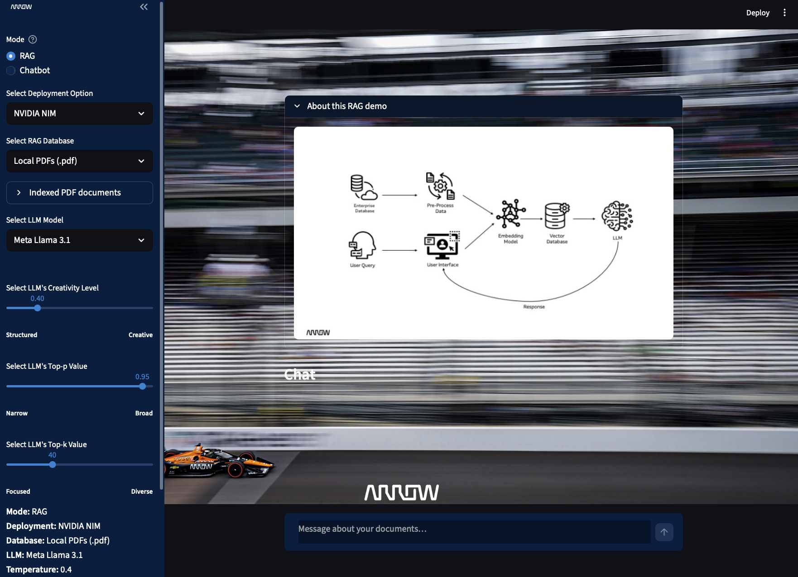
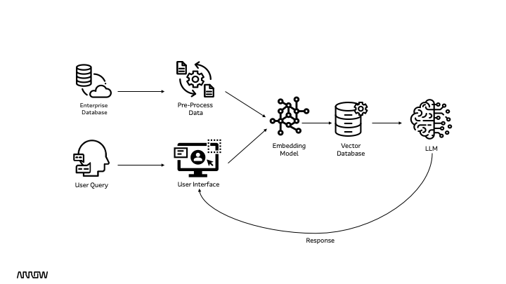
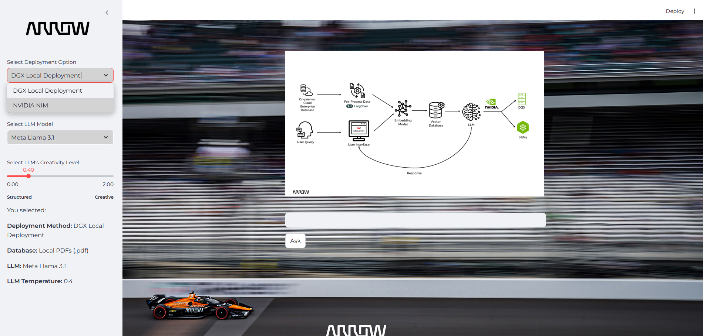
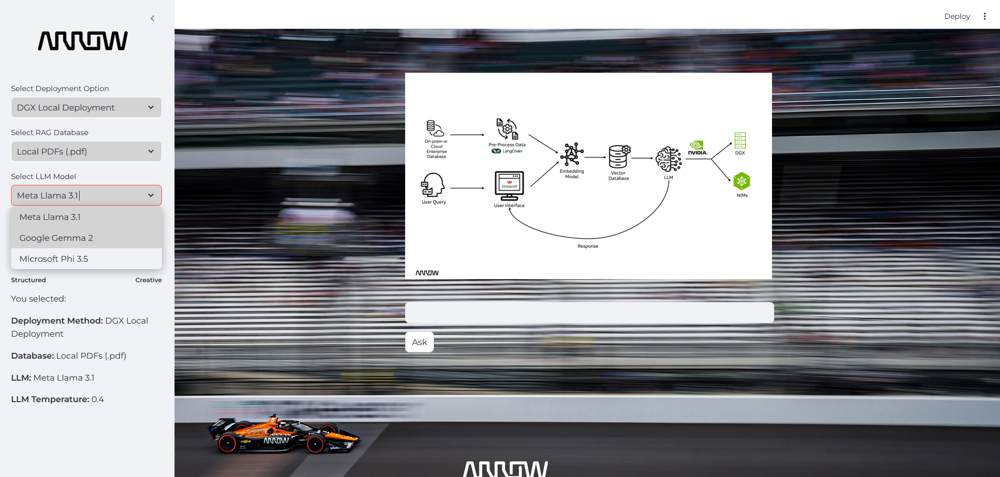
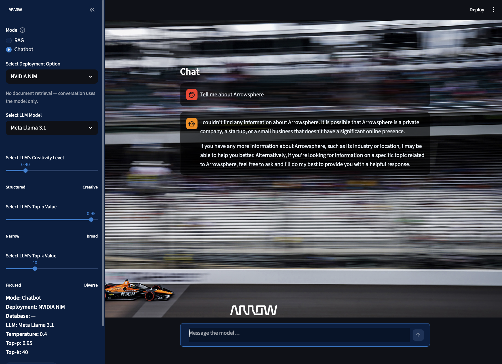
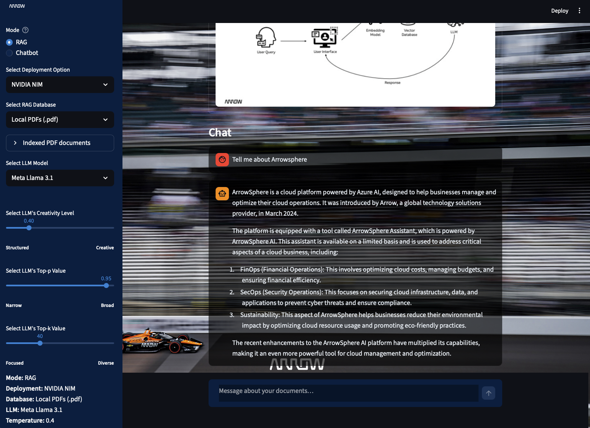

# Welcome to Arrow RAG Assistant Demo! 

This demo demonstrates how to easily deploy and customize a **Retrieval Augmented Generation (RAG)** model using **NVIDIA NIMs** or a **local OpenAI-compatible server** (for example **[vLLM](https://docs.vllm.ai)**), enabling high-performance inference for enterprise use cases.



RAG, or Retrieval Augmented Generation, is a framework that combines the strengths of large language models (LLMs) and external knowledge retrieval systems. It allows the model to fetch relevant information from external sources, such as databases or knowledge bases, during the generation process, improving accuracy and relevance while reducing hallucinations.



## Features

This demo offers flexibility and customization in the following areas:

**Deployment Options**: Choose between a **local vLLM** (or any OpenAI-compatible HTTP API) and **NVIDIA NIMs**.



**Retrieval Sources**: You can select from different retrieval sources, including uploading a PDF, using previously chosen PDFs about Arrow Electronics in the "docs" folder, or specifying URLs in rag_engine.py file. 


**LLM Selection**: The demo currently features LLaMA 3.1, Phi 3.5, and Gemma 2. However, you can swap out these models for any compatible LLM.

**LLM Parameters**: Use an interactive slider to adjust model parameter temperature. The code can also be customized to modify additional properties such as top-k or top-p values, allowing fine-tuning of the model's output.




**Application & UI Customization**: 

This demo is built using LangChain for the RAG process and Streamlit for the frontend, providing a seamless, interactive experience. You can personalize the theme, font, and branding to suit your preferences.




## Running the Demo

Follow these steps to set up and run the demo:

**1. Run an OpenAI-compatible LLM server (vLLM)**

Serve a model with vLLM (or another OpenAI-compatible stack) so it exposes an HTTP API (by default vLLM uses port **8000**). The model name you pass to `vllm serve --model ...` must match what the app sends (see environment variables below).

**2. Configure the local endpoint (optional)**

By default the app calls `http://127.0.0.1:8000/v1`. Override if needed:

    export OPENAI_BASE_URL=http://127.0.0.1:8000
    export OPENAI_API_KEY=EMPTY

If your server checks API keys, set `OPENAI_API_KEY` accordingly.

Set the model id to match your running server (recommended when you serve a single model, e.g. Nemotron):

    export VLLM_MODEL='exact-model-name-from-vllm-serve'

If `VLLM_MODEL` is unset, the UI mapping uses Hugging-Face-style defaults per dropdown; override per family with `VLLM_MODEL_LLAMA`, `VLLM_MODEL_GEMMA`, `VLLM_MODEL_PHI`, or `VLLM_MODEL_NEMOTRON` (for **NVIDIA Nemotron 3 Nano**) if you prefer. For NVIDIA NIM, set `NIM_MODEL_NEMOTRON` if the catalog id differs from the default.

**3. Install Required Packages**

Install the necessary Python packages listed in requirements.txt:

    pip install -r requirements.txt

**4. Set NVIDIA_API_KEY** (only for NVIDIA NIM in the UI):

Generate your API key from [NVIDIA NIMs API Catalog](https://build.nvidia.com/explore/discover). Either export it in your shell:

    export NVIDIA_API_KEY='nvapi-???'

Or create a **`.env`** file in the project root (this file is gitignored) with:

    NVIDIA_API_KEY=nvapi-???

Then load it before starting the app (bash):

    set -a && source .env && set +a

Streamlit does not read `.env` automatically; you must export or source as above for a local run.

**5. Run the Frontend**
Start the Streamlit app:

    streamlit run rag.py

**6. Open Port 8501**

Make sure port ```8501``` is open on your localhost to access the demo in your browser. You can change the port in ```./.streamlit/config.toml``` file. 


**7. Experiment with the Demo**

Explore the demo and experiment with different deployment, retrieval, and model options to see how RAG can improve inference for your use cases.



## Docker

The image installs **`faiss-gpu`** (same as `requirements.txt`). PyPI only ships `faiss-gpu` wheels for **Python 3.10**, so the Dockerfile uses `python:3.10-slim-bookworm`. Use a **GPU-capable runner** (`docker compose` or `docker run --gpus all`) plus the [NVIDIA Container Toolkit](https://docs.nvidia.com/datacenter/cloud-native/container-toolkit/latest/install-guide.html) on the host so FAISS can use the GPU.

For **NVIDIA NIM**, the container must receive `NVIDIA_API_KEY` (Compose loads it from **`.env`**; see below). For **Local vLLM**, the container must reach your OpenAI-compatible server (for example vLLM on the host). If vLLM already uses all GPU memory, consider running this container **without** a GPU reservation and rely on CPU for embeddings/FAISS to avoid CUDA OOM.

### Build

    docker build -t arrow-rag-demo:local .

The Dockerfile reinstalls **NumPy 1.x** after the rest of the stack because **`faiss-gpu` does not work with NumPy 2** (you would see `_ARRAY_API` / `multiarray` errors). If an old layer still has NumPy 2, rebuild with **`docker build --no-cache -t arrow-rag-demo:local .`**.

### Run with Docker Compose (recommended)

Create **`.env`** in the project root with at least `NVIDIA_API_KEY=nvapi-...` if you will use **NVIDIA NIM** in the UI. `docker-compose.yml` maps port **8501**, requests all GPUs, and passes variables from **`.env`** into the container.

    docker compose up

Use `docker compose up -d` to run detached. A plain `docker run` does **not** read `.env` from disk unless you pass **`--env-file`** or **`-e`** yourself; Compose wiring avoids repeating those flags.

### Run with `docker run`

Streamlit listens on port **8501**. Without an API key in the environment, **NVIDIA NIM** in the UI will fail until you inject the key.

    docker run --rm -p 8501:8501 --gpus all arrow-rag-demo:local

Pass the key explicitly:

    docker run --rm -p 8501:8501 --gpus all -e NVIDIA_API_KEY='nvapi-...' arrow-rag-demo:local

Or reuse your **`.env`** file:

    docker run --rm -p 8501:8501 --gpus all --env-file .env arrow-rag-demo:local

vLLM on the host from a container (Linux Docker 20.10+). **Quote the model id** (do not use raw `<...>` in the shell — `<` is input redirection and breaks `docker run`):

    docker run --rm -p 8501:8501 --gpus all --add-host=host.docker.internal:host-gateway \
      -e OPENAI_BASE_URL=http://host.docker.internal:8000 \
      -e VLLM_MODEL='org/model-name-from-vllm-serve' \
      arrow-rag-demo:local

Inside the container, `localhost:8000` is the container itself, not the host. Point `OPENAI_BASE_URL` at the host (as above) or at `http://<host-LAN-IP>:8000`. On Linux you can use `--network host` instead so `http://127.0.0.1:8000` reaches vLLM on the host.

**Troubleshooting — `404` / “model does not exist”:** vLLM only accepts the **exact** model name it registered. Set `VLLM_MODEL` (or `VLLM_MODEL_NEMOTRON` when using the Nemotron option without a global `VLLM_MODEL`) to the **`id`** from the running server:

    curl -s http://127.0.0.1:8000/v1/models | python3 -m json.tool

If you started vLLM with `--served-model-name my-nemotron`, use **`my-nemotron`** as the id, not necessarily the Hugging Face repo path.


## Additional Resources

* [NVIDIA NIM API Catalog](https://build.nvidia.com/explore/discover)

* [LangChain Documentation](https://python.langchain.com/docs/introduction/)

* [Streamlit Documentation](https://docs.streamlit.io)

* [vLLM documentation](https://docs.vllm.ai)